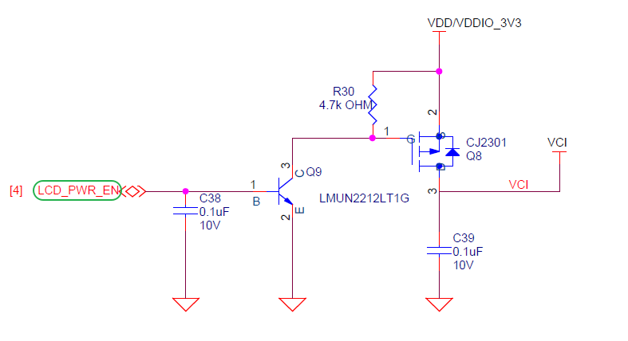
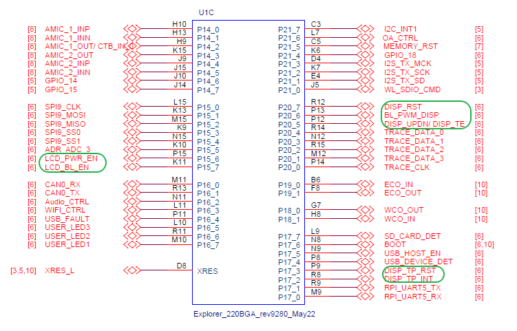
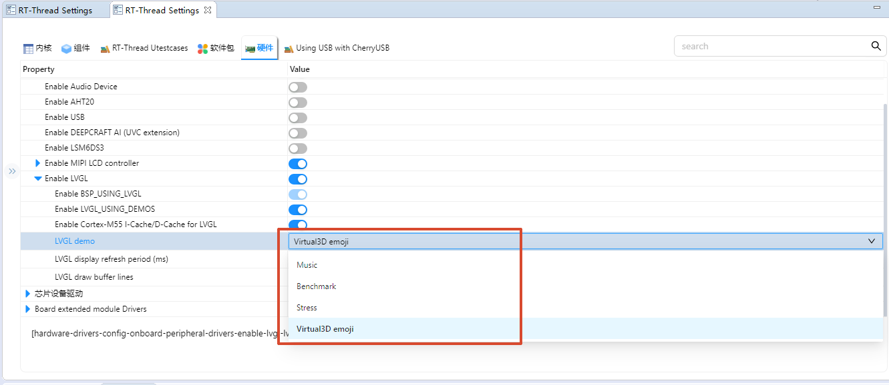

# FeatherTalk M55 Product Project

[**中文**](./README_zh.md) | **English**

## Introduction

This product runs on the **M55 application core** under RT-Thread. The default UI is the feature-complete **LVGL 9.2 FeatherTalk Shell**, with a product-specific frame pipeline: collect all draw tasks first, encode one continuous VG-Lite command chain, submit the GPU once per frame, and present through two direct-scanout RGB565 framebuffers.

`libraries/FeatherUI` and `applications/gpu_ui` remain GPU-native experiments and comparison implementations. The current `product/edgi-talk` configuration enables `FEATHERTALK_USING_UI_SHELL` and `FEATHERTALK_USING_LVGL_GPU_BATCH`, and does not start `FEATHERTALK_USING_GPU_UI`.

Run `feather_ui_bench` on the M55 console for a repeatable 60-frame full-screen benchmark and `feather_ui_status` for cumulative task, phase, GPU-busy, and scanout statistics. Two consecutive 2026-09-01 board runs measured 60/60 frames, **22.70–23.98 FPS**, one submit per frame, 100% GPU-routed draw tasks, **23.66–24.99% hardware GPU busy**, and about 7.4/19.4/10.8 ms average collect/encode/finish phases. Task-routing percentage and hardware-busy percentage are intentionally reported separately.

### LVGL Overview

**LVGL** (Light and Versatile Graphics Library) is an open-source embedded GUI development framework designed for resource-constrained devices. It provides modern graphical interfaces with optimized CPU and memory usage, running efficiently on both low-end MCUs and more powerful MPU platforms.

#### Key Features

1. **Lightweight**
   Optimized for minimal memory and CPU usage, ideal for low-power devices and resource-constrained environments.

2. **Cross-platform**
   Runs on multiple operating systems (FreeRTOS, RT-Thread, Zephyr, Linux) or bare-metal platforms. Only requires display and input drivers to be ported.

3. **Rich Widgets**
   Includes buttons, labels, sliders, charts, tables, lists, etc., and allows custom widget extensions.

4. **Advanced Rendering**
   Supports anti-aliasing, transparency, gradients, shadows, rounded corners, and animations for modern UIs.

5. **Input Device Support**
   Supports touchscreens, capacitive touch, mouse, keyboard, encoder, and multi-touch. Events are unified via LVGL’s event system.

6. **Internationalization**
   UTF-8 encoding with support for bidirectional text (e.g., Arabic, Hebrew).

7. **Extensibility**
   Flexible themes, styles, and integration with file systems and image decoders.

#### Applications

LVGL is widely used in:

* Consumer electronics (smart home panels, smartwatches, appliances)
* Industrial HMI and instrumentation
* Automotive displays (central console, passenger screen, instrument cluster)
* Medical devices (portable monitors, handheld instruments)

#### Ecosystem & Community

LVGL is **MIT licensed** and supported by **SquareLine Studio** for GUI design and **LVGL Simulator** for PC-based development. A large community provides open-source widgets, themes, and porting examples.

## Hardware Description

### Backlight Interface


### MIPI Interface


### PWR Interface



### BTB Socket


### MCU Interface




## Software Description

* Developed on the **Edgi-Talk platform**, running on the **M55 application core**.
* Example features:

  * Initialize **LVGL 9.2**, frame-level GPU batching, LCD direct scanout, and touch input
  * Start the FeatherTalk product Shell by default
  * Keep **lv_demo_music**, **lv_demo_benchmark**, and **lv_demo_stress** as optional SDK comparison builds when the product Shell is disabled
  * Automatically respond to M33 HELLO and heartbeat messages over the PSoC E84 IPC Pipe
  * Enable M55 I-Cache/D-Cache and draw directly into dual DC scanout framebuffers
* Code structure is clear for understanding display driver integration and LVGL porting.

## Demo Description

The `BSP_LVGL_DEMO_*` options select native SDK comparison demos. They are not started while the FeatherTalk product Shell is enabled; disable the Shell first and select only one demo for an official-demo A/B build.

| Configuration | Demo | Description |
| --- | --- | --- |
| `BSP_LVGL_DEMO_MUSIC` | LVGL Music Demo | Default official LVGL UI, used to verify complex widgets, layouts, styles, and animations. |
| `BSP_LVGL_DEMO_BENCHMARK` | LVGL Benchmark Demo | Official LVGL performance benchmark demo, used to observe rendering performance, frame rate, and score. |
| `BSP_LVGL_DEMO_STRESS` | LVGL Stress Demo | Official LVGL stress test demo. It repeatedly creates, refreshes, and destroys widgets to verify rendering stability and memory usage. |

To switch demos, modify the LVGL Demo configuration in **RT-Thread Settings** or `menuconfig`. It is recommended to select only one `BSP_LVGL_DEMO_*` option at a time, then regenerate the configuration, rebuild, and download the firmware.



## Usage

### Build and Download

1. Open and compile the project.
2. Connect the board USB to the PC using the **onboard debugger (DAP)**.
3. Flash the generated firmware to the board.

### Running Result

* After flashing and powering on, the example starts automatically.
* With the default configuration, the LCD starts the FeatherTalk UI Shell.
* The serial console prints the UI-ready state, for example:

```
[FeatherTalk UI] shell ready: 480x800 apps=5 route-depth=1
```

* `feather_m55_status` reports the M55 IPC and LVGL-ready state on the UART2 diagnostic console.

## Notes

> **⚠️ Note:** This project requires **RT-Thread Studio 2.2.9** or higher.

* To modify the **graphical configuration**, use:

```
tools/device-configurator/device-configurator.exe
libs/TARGET_APP_KIT_PSE84_EVAL_EPC2/config/design.modus
```

* Save and regenerate code after modifications.
* The product configuration enables CPU cache, LVGL GPU batching, FULL render, and dual-framebuffer direct scanout. If cache, framebuffer, stride, or submission boundaries change, re-check GPU/DC ownership and the ELF `.cy_gpu_buf` size.
* If the screen shows no output, check:

  * LCD connections and power supply
  * `lv_port_disp.c` and `lv_port_indev.c` match the actual hardware
  * LCD rotation angle is compatible with the selected demo

## Startup Sequence

```
+------------------+
|   Secure M33     |
|  (Secure Core)   |
+------------------+
          |
          v
+------------------+
|       M33        |
| (Non-Secure Core)|
+------------------+
          |
          v
+-------------------+
|       M55         |
| (Application Core)|
+-------------------+
```

⚠️ Strictly follow the flashing order to ensure proper system operation.

---

* If the application fails, first flash **FeatherTalk_M33** to ensure proper initialization and M55 startup.
* To enable M55, configure in **M33 project**:

```
RT-Thread Settings --> Hardware --> select SOC Multi Core Mode --> Enable CM55 Core
```
