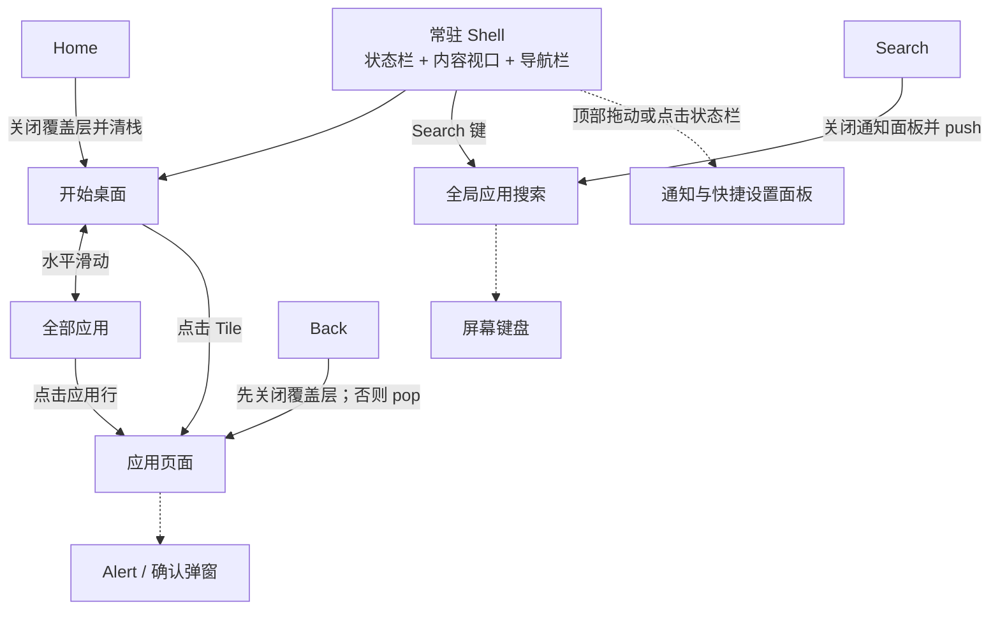
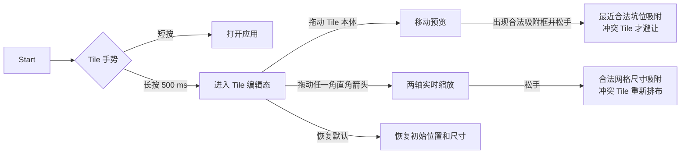
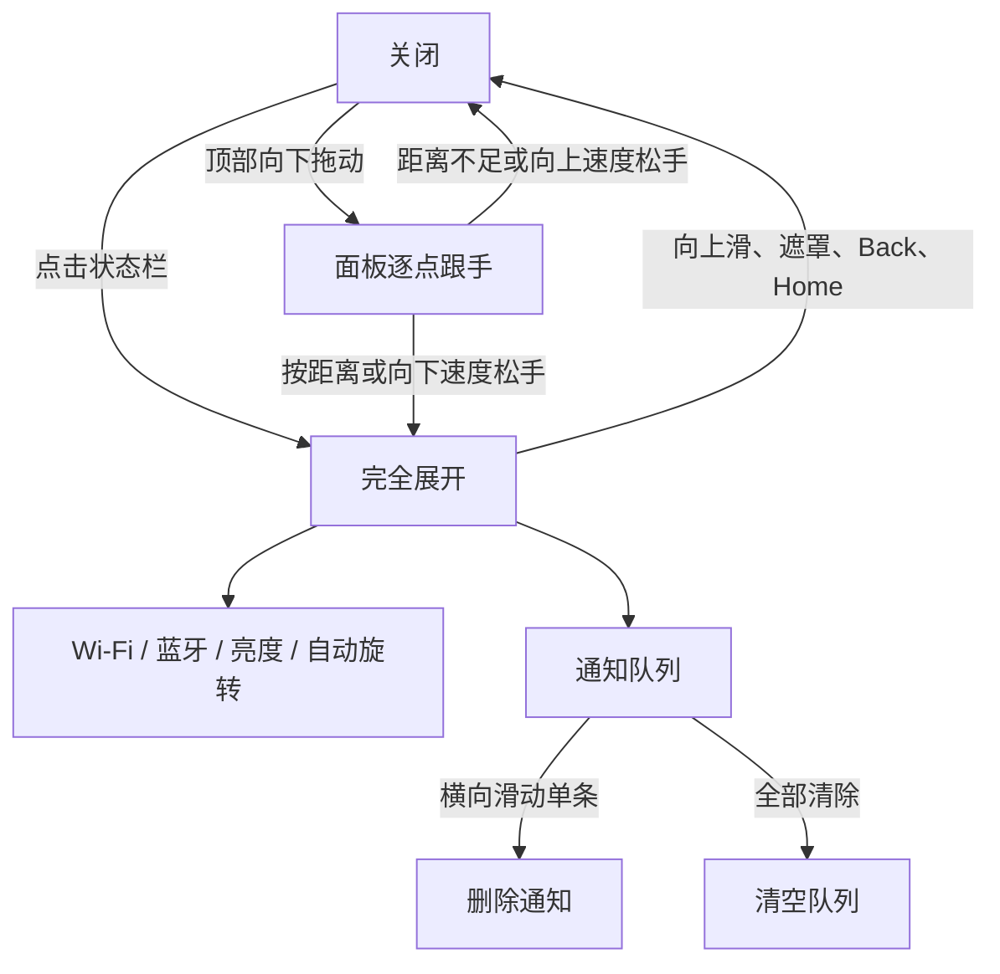
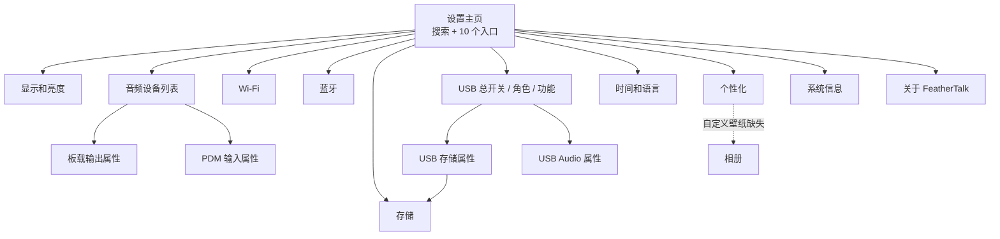
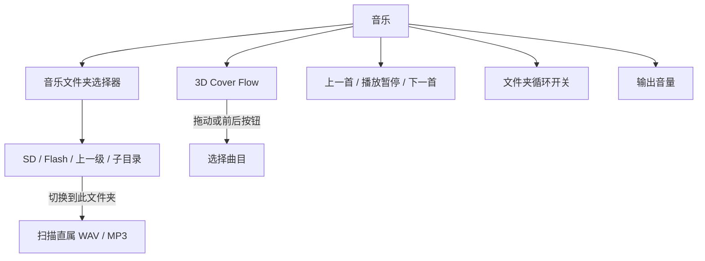
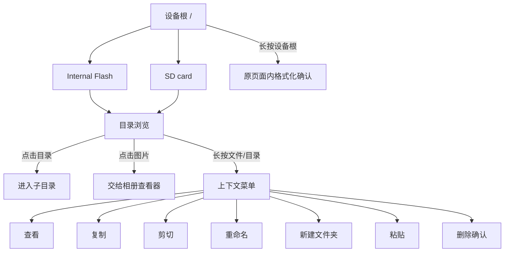

# FeatherTalk UI 功能导航图

> 导航图版本：2026-09-04
>
> 对应工程：`projects/FeatherTalk_M55`
>
> 当前基线：21 个路由页面、5 个桌面应用、10 个设置入口、32 个实板性能场景

本文是 FeatherTalk 产品 UI 的导航与功能契约，不是效果草图。新增、删除或重命名页面，
改变入口、返回语义、控件能力、硬件门控、状态持久化或测试场景时，必须在同一次改动中
更新本文。`tools/freather/check-ui-navigation-map.py` 会在每次 M55 构建前检查全部路由页面
和性能场景是否仍被本文覆盖。

## 1. 权威来源与图例

| 内容 | 权威来源 |
|---|---|
| 页面 ID 与公共数据模型 | `feathertalk_ui_internal.h` |
| 应用、设置项目和页面生命周期 | `feathertalk_ui_pages.c` 的 `s_apps[]`、`s_settings[]`、`s_pages[]` |
| push、Back、Home 和最大深度 | `feathertalk_ui_router.c` |
| 桌面 Tile 编辑和吸附 | `feathertalk_ui_tiles.c` |
| 通知面板与队列 | `feathertalk_ui.c`、`feathertalk_ui_notifications.c` |
| 相册、录音机 | `feathertalk_ui_gallery.c`、`feathertalk_ui_recorder.c` |
| 自动交互契约 | `feathertalk_ui_test.c` |
| 性能场景 | `feathertalk_ui.c`、`tools/freather/benchmark-ui-scenes.py` |

图中实线表示路由跳转，虚线表示覆盖层或同一页面内部状态切换。所有路由页面共享顶部
状态栏、内容视口和底部 Back/Home/Search 导航栏；弹窗、键盘、通知面板和 Tile 编辑态
不是独立路由页面。

## 2. 顶层导航



### 全局按键和覆盖层优先级

| 输入 | 当前存在覆盖层时 | 没有覆盖层时 |
|---|---|---|
| Back | 先关闭通知面板、键盘、查看器或页面自有弹窗 | 路由栈 pop；根页面保持 Start |
| Home | 关闭覆盖层，释放所有子页面，返回 Start 视图 | 返回 Start；路由深度归 1 |
| Search | 关闭通知面板，进入全局应用搜索 | push 搜索页；不会伪造网页或文件搜索 |
| 点击遮罩 | 关闭对应 Alert、菜单、文件夹选择器或通知面板 | 无动作 |

路由栈最大深度为 8。`push` 隐藏上一页并创建新页；`Back` 优先交给页面自己的
`on_back`，未消费时才删除当前页；`Home` 连续执行 Back 直到根页面。启用壁纸后，
push/pop 会额外使整个内容视口失效一次，避免透明页面留下旧像素。

## 3. 桌面与系统级交互分支

### 3.1 开始桌面



- 默认应用：设置（2×1）、媒体（1×1）、录音机（1×1）、相册（1×1）、文件（2×1）。
- Tile 公共属性：名称、列/行跨度、透明度、图案；私有属性：应用图标、Live Tile 是否循环、
  周期、内容回调及上下文。
- 长按前不会进入编辑态；编辑态中 Tile 本体继续缩放弹跳，四角箭头位于自身范围内且不随
  弹跳移动。拖动本体用于移动，角部扩大命中区仅用于缩放。
- 移动尚未确认时其他 Tile 不动；出现合法吸附框后，只移动发生冲突、必须让位的 Tile。
  释放后全部 Tile 动画落到最终网格，选中 Tile 保持选中动画。
- 靠近桌面底部移动或缩放会触发边缘滚动，因此逻辑桌面底部仍可产生合法吸附位置。
- 媒体 Tile 拥有应用私有的循环内容；其他默认 Tile 当前为静态内容。

### 3.2 通知与快捷设置面板



- Wi-Fi 读取 M55 WLAN 服务，蓝牙和旋转读取 M33 IPC 的 capability/enabled/connected 状态；驱动未接入时显示
  “不可用”且保持禁用，不允许 UI 假切换。
- Wi-Fi 根据实际信号值显示断开、弱、中、强；状态栏同时显示 Wi-Fi/蓝牙连接状态。
- 两个无线开关分别显示真实处理中/完成/失败；处理期间只禁用自身，另一项仍可操作。蓝牙
  PENDING 来自 M33 异步生命周期，Wi-Fi busy 来自本核后台队列；不乐观翻转硬件状态。
- 亮度由 M55 `pwm18` 实际读写，UI 0%～100% 映射硬件 50%～100% 占空比。
- 通知队列固定容量 8，具有稳定 ID、未读数、打开后标记已读、单条滑动删除和全部清除。
- 拖动期间暂停一秒状态刷新、Live Tile 刷新和快捷状态刷新；相同触摸坐标不会重复重绘。

### 3.3 搜索、键盘和 Alert

- 全局 Search 只过滤 5 个已注册应用；点击结果 push 对应应用。
- 设置搜索只过滤 10 个设置入口，匹配标题、摘要和关键词。
- 搜索框获得焦点后，键盘固定覆盖底部键盘区域，不推动页面到屏幕外；可使用收起键关闭，
  再次点击输入框重新打开。
- 统一键盘按键区高度为屏幕高度的 30%，最多占去除状态栏/导航栏后内容区的一半，不由字体
  缩放或页面剩余空间决定。480×800 时所有按键区均为 240 px；搜索/设置的收起栏额外显示，
  不挤压按键区。所有入口只使用 `ft_ui_keyboard_create()`，未来新页面也默认继承。
- 构建检查禁止产品应用绕开公共组件直接调用 LVGL 键盘构造器；调整默认比例只需修改
  `feathertalk_ui_layout.c` 的 `FT_KEYBOARD_SCREEN_PERCENT`，不逐页修改尺寸。
- Wi-Fi 密码表单和键盘是独立的滚动区与底部停靠区：只滚动上方表单，隐藏/重新展开键盘
  或切换字母/符号模式不改变键盘高度。文件新建/重命名框按内容收紧、停靠导航栏上方，
  内部键盘使用同一比例高度，不再把 88% 屏高的弹窗剩余空间全部撑满。
- Alert、格式化确认、删除确认、文件上下文菜单、文件名编辑器和音乐文件夹选择器均为覆盖层，
  不增加路由深度。

## 4. 设置应用导航



### 4.1 设置功能契约

| 设置分支 | 可操作项 | 底层状态与限制 | 持久化 |
|---|---|---|---|
| 显示和亮度 | 亮度滑杆、面板信息 | 写入并读回 `pwm18`；安全映射避免黑屏 | 亮度偏好 |
| 音频主页 | 选择默认输出/输入；点击箭头进入属性 | `sound0`、`mic0` 默认注册；AMIC2 无驱动时不可选 | 默认设备/音量/增益 |
| 输出属性 | 测试、音量、采样率、位深、声道数 | 只开放 `sound0`、TDM0、ES8388 整链路接受的组合；失败回滚 | 输出格式与音量 |
| 输入属性 | 增益；显示输入格式 | `mic0` 当前固定 16 kHz、16 bit、双声道；没有伪造格式选择 | 输入增益 |
| Wi-Fi | 总开关、被动扫描列表、密码连接、断开、SSID/IP/网关/MAC/RSSI | M55 WHD + SDIO0；后台串行操作；初始化/忙时禁用相应操作 | 本阶段不落盘保存密码；退出表单清空密码 |
| 蓝牙 | 独立开关、处理中/失败、BLE 或 Classic 连接状态 | 依赖 M33 蓝牙 capability；未接入或本项处理中禁用按钮 | 异步请求后回读真实状态；页面 200 ms 监视随 pop 释放 |
| 存储 | 选择 Internal Flash/SD、容量视图、刷新、格式化、进入文件 | 分别显示两个介质；格式化采用两阶段确认；SD 缺失仍显示设备槽 | 文件系统自身持久化 |
| USB 主页 | 总开关；Device/Host；MSC/UAC2 单选；属性入口 | Host 因无受控 5 V VBUS 禁用；关闭真正 deinit USB；运行中切换执行 stop-old/start-new | 记住待启动功能 |
| USB 存储属性 | LUN0 Flash、LUN1 SD 状态；进入存储管理 | 固定末尾 2 MiB Flash + SD 双 LUN；SD 不可导出时 MSC 不能开启 | 无独立 UI 偏好 |
| USB Audio 属性 | 输出/输入设备、格式和枚举状态 | UAC2 主机/设备格式双向同步；输出同步外部 DAC；输入受 `mic0` 能力限制 | UAC 设备格式 |
| 时间和语言 | 12/24 小时、固定 UTC 时区、简中/英语 | 切换语言重建当前路由树；Feather、PSoC、USB 等产品词不翻译 | A/B Flash 偏好 |
| 个性化 | 5 种强调色、3 档 Tile 透明度、纯黑/深色/强调色/相册壁纸 | 未选照片时点击自定义壁纸会提示并进入相册 | A/B Flash 偏好 |
| 系统信息 | 摘要卡、4 个展开区 | 展示物理容量、链接分配和运行使用；运行区由 M33 IPC/UI metrics 更新 | 只读 |
| 关于 | 产品、固件、IPC 版本 | 不重复承担系统资源清单 | 只读 |

## 5. 应用功能分支

### 5.1 音乐



- 文件夹选择立即停止旧轨道并用新目录直属 WAV/MP3 重建播放列表；不会递归混入子目录。
- PCM WAV 直接播放；MP3 使用仓库内 `minimp3` 解码并转换到板载 TDM/ES8388 输出格式。
- Cover Flow 中央封面正面显示，两侧使用 GPU 透视变换；拖动释放后吸附到曲目中心。
- 上一首/下一首按播放列表回绕；循环开启时曲末自动进入下一首并在目录末尾回绕。
- 页面离开时关闭页面计时器和文件夹弹窗；播放器状态由播放器服务统一管理。

### 5.2 录音机

- 输入设备：双 PDM 麦克风阵列可用；AMIC2 显示但驱动未注册时禁用。
- 点击开始后显示录音时长和峰值电平；录音期间禁止切换设备。
- 点击“结束并保存”生成标准 PCM WAV。保存路径自动选择，优先 `/sdcard/Recordings`，
  其次 `/flash/Recordings`。
- 没有可写介质时禁用开始；离开页面时若仍在录音会请求停止并保存。
- “在文件中查看录音”push 文件应用；录音期间该入口禁用。

### 5.3 相册

```mermaid
flowchart LR
    Gallery[相册浏览] --> Flash[/flash/Pictures]
    Gallery --> SD[/sdcard/Pictures]
    Flash --> List[缩略图列表]
    SD --> List
    List -->|点击 JPG/PNG/BMP| Viewer[查看器]
    Viewer --> Prev[上一张]
    Viewer --> Next[下一张]
    Viewer --> Wallpaper[设为壁纸]
    Viewer --> Delete[删除确认]
    Viewer --> Close[返回浏览]
```

- 挂载后自动创建专用 Pictures 目录；介质缺失时保留来源入口并显示不可用原因。
- 缩略图和全图采用渐进解码，先显示查看器及加载状态，再提交实际 RGB565 图像。
- 文件应用点击受支持图片时复用同一个查看器流程，不复制出第二套图片页面。
- 删除必须明确确认当前图片；设为壁纸写入每台设备自己的 A/B Flash UI 配置。
- Back 在查看器内先返回相册浏览；已经处于浏览状态才 pop 相册页面。

### 5.4 文件



- 根页只列出 `/flash` 和 `/sdcard` 两个设备入口，不允许重命名、复制或删除设备根。
- 普通点击目录进入，点击图片交给相册，其他文件显示可用信息；刷新和上一级常驻。
- 删除、复制、剪切、重命名、新建文件夹和粘贴只在长按菜单中出现，不在每行常驻。
- 目录支持递归复制/移动/删除；拒绝同名覆盖、非法名称、路径越界和把目录粘贴进自身。
- 长按当前目录或空白区域可新建文件夹、粘贴和刷新；剪贴板为空时粘贴禁用。
- 长按设备根触发锁定目标的两阶段格式化确认，确认或取消后均留在文件应用。
- MSC 导出期间本机文件系统临时失去介质所有权，文件、相册、音乐和录音必须显示忙状态，
  不允许与 USB Host 同时写入。

## 6. 全部路由页面契约

本表中的 Page ID 必须与 `ft_page_id_t` 和 `s_pages[]` 一一对应。Scene 标识由构建检查器
与实板基准脚本核对。

| Page ID | 页面 | 主要入口 | 页面内状态/主要操作 | Back 与生命周期 | Scene |
|---|---|---|---|---|---|
| FT_PAGE_HOME | Start | Shell 初始化、Home | Start/全部应用切换，Tile 打开与编辑 | 根页面；Back 回 Start 视图 | SCENE-00 |
| FT_PAGE_SEARCH | Search | 底部 Search | 应用过滤、键盘、打开结果 | 关闭键盘或 pop | SCENE-01 |
| FT_PAGE_SYSTEM | 系统信息 | 设置入口 | 摘要卡、展开资源与运行状态 | pop 设置；内容只读 | SCENE-02 |
| FT_PAGE_SETTINGS | 设置 | Settings Tile/应用行 | 设置搜索、键盘、10 个分类 | pop 桌面 | SCENE-03 |
| FT_PAGE_MEDIA | 音乐 | Media Tile/应用行 | 文件夹、Cover Flow、播放控制、循环、音量 | leave 删除 UI 定时器/弹窗 | SCENE-04 |
| FT_PAGE_RECORDER | 录音机 | Recorder Tile/应用行 | 输入设备、开始、停止保存、查看文件 | leave 停止活动录音并释放监视器 | SCENE-05 |
| FT_PAGE_GALLERY | 相册 | Gallery Tile、文件图片、壁纸引导 | 来源、缩略图、查看、壁纸、删除 | 查看器优先消费 Back；leave 释放解码资源 | SCENE-06 |
| FT_PAGE_FILES | 文件 | Files Tile、录音机、存储管理 | 双介质浏览、上下文菜单、编辑、格式化 | 子目录先向上；根目录才 pop | SCENE-07 |
| FT_PAGE_ABOUT | 关于 FeatherTalk | 设置入口 | 产品、固件、IPC 版本 | pop 设置；只读 | SCENE-08 |
| FT_PAGE_SETTINGS_DISPLAY | 显示和亮度 | 设置入口 | PWM 亮度、面板信息 | pop 设置 | SCENE-09 |
| FT_PAGE_SETTINGS_AUDIO | 音频 | 设置入口 | 输出/输入设备单选与属性箭头 | pop 设置 | SCENE-10 |
| FT_PAGE_SETTINGS_WIFI | Wi-Fi | 设置入口 | 总开关、扫描、选择网络、密码键盘、连接/断开、IP/RSSI | Back 先关闭密码表单，再 pop 设置；删除页释放 timer | SCENE-11 |
| FT_PAGE_SETTINGS_BLUETOOTH | 蓝牙 | 设置入口 | 能力、开关、连接 | pop 设置 | SCENE-12 |
| FT_PAGE_SETTINGS_STORAGE | 存储 | 设置、USB 存储属性 | Flash/SD 选择、容量、格式化、文件入口 | leave 关闭介质监视器 | SCENE-13 |
| FT_PAGE_SETTINGS_USB | USB | 设置入口 | 总开关、Device/Host、MSC/UAC2、属性箭头 | leave 关闭 USB UI 监视器 | SCENE-14 |
| FT_PAGE_SETTINGS_TIME_LANGUAGE | 时间和语言 | 设置入口 | 12/24 小时、时区、简中/英语 | pop 设置；语言改变重建路由 | SCENE-15 |
| FT_PAGE_SETTINGS_PERSONALIZATION | 个性化 | 设置入口 | 强调色、Tile 透明度、背景/壁纸 | pop 设置 | SCENE-16 |
| FT_PAGE_SETTINGS_AUDIO_OUTPUT | 输出属性 | 音频输出设备箭头 | 测试、音量、输出格式 | pop 音频设备列表 | SCENE-28 |
| FT_PAGE_SETTINGS_AUDIO_INPUT | 输入属性 | 音频输入设备箭头 | 增益、只读输入格式 | pop 音频设备列表 | SCENE-29 |
| FT_PAGE_SETTINGS_USB_STORAGE | USB 存储属性 | MSC 属性箭头 | 双 LUN 状态、进入存储管理 | pop USB；共享 USB 监视器不提前销毁 | SCENE-30 |
| FT_PAGE_SETTINGS_USB_AUDIO | USB Audio 属性 | UAC2 属性箭头 | 输入/输出设备、格式、枚举同步 | pop USB；共享 USB 监视器不提前销毁 | SCENE-31 |

## 7. 非路由视觉状态与性能场景

| Scene | 起始页面/覆盖层 | 验证重点 |
|---|---|---|
| SCENE-17 | 全部应用 | Start 与 All Apps 横向切换、应用列表 |
| SCENE-18 | 通知面板完全展开 | 快捷按钮、通知队列、遮罩 |
| SCENE-19 | 通知面板中间拖动 | 跟手位置、量化遮罩、刷新抑制 |
| SCENE-20 | Search + 键盘 | 底部覆盖键盘与搜索布局 |
| SCENE-21 | Settings + 键盘 | 设置过滤与键盘布局 |
| SCENE-22 | Tile 编辑态 | Tile 本体缩放、四角手柄、层级和裁剪 |
| SCENE-23 | 相册查看器 | 解码图、信息、控制区与页面接缝 |
| SCENE-24 | 文件上下文菜单 | 长按菜单、字体、遮罩和目标状态 |
| SCENE-25 | 音乐播放状态 | 进度、播放器轮询和 Live Tile |
| SCENE-26 | 音乐文件夹选择器 | 双介质目录浏览和弹窗布局 |
| SCENE-27 | Alert | 模态提示、遮罩和关闭路径 |

## 8. 状态归属与持久化

| 状态 | 所有者 | 生命周期/存储 |
|---|---|---|
| 路由栈 | `feathertalk_ui_router.c` | RAM，最大 8；Home 归一化为根 |
| 通知队列 | `feathertalk_ui_notifications.c` | RAM，固定 8 条；与 LVGL 对象寿命解耦 |
| Tile 布局和编辑态 | `feathertalk_ui_tiles.c` | 运行期模型；默认布局可恢复 |
| 强调色、透明度、语言、时间、背景、壁纸 | preferences + store | Flash 末尾 2 MiB 文件系统中的 CRC A/B 记录，掉电保持 |
| Wi-Fi | M55 Wi-Fi service + WHD/RT-Thread WLAN | 后台请求队列；本地状态合入快捷状态，不被 M33 心跳覆盖 |
| 蓝牙/旋转 | M33 IPC | 硬件是真实来源；UI 只发送请求并显示回读。蓝牙由单 owner 执行启停，PENDING/OK/FAILED 区分接受与完成 |
| 无线共享资源 | FeatherTalk Common Radio Manager | 两功能独立占用/状态/错误；Wi-Fi 关闭只停 WLAN MAC，蓝牙关闭只回收 HCI/UART/BT_REG_ON；保留公共供电，普通 UI 不提供整模组复位 |
| 背光 | M55 PWM | 实时读写 `pwm18`，偏好保存用户值 |
| 存储容量/挂载/占用 | storage service | Flash/SD 和 USB 所有权实时探测 |
| USB class 与 UAC 格式 | USB/UAC service | 驱动是真实来源；UI 与 Host 双向同步 |
| 播放与录音 | player/recorder service | 页面对象释放不等于伪造服务状态；录音离页会停止保存 |
| FPS、GPU、heap、对象数 | UI metrics | 运行时统计，只读，不持久化 |

## 9. 当前能力边界

- USB Host：硬件没有受控 5 V VBUS source，显示但不可选择。
- Wi-Fi：依赖 M55 WHD 初始化成功；当前首轮只做 STA，不提供 AP、配网持久化或自动重连承诺。
- 蓝牙：需要 M33 对应驱动和 IPC capability；缺失时不能由 UI 模拟开启。
- 自动旋转：需要 M33/传感器能力；缺失时快捷按钮禁用。
- AMIC2：没有注册 RT-Thread Audio 输入驱动，录音机中显示但不可选。
- PDM 输入格式：当前驱动固定 16 kHz、16 bit、双声道，UI 只读显示。
- MSC：当前要求 Internal Flash 与 SD 两个 LUN 均可导出；SD 缺失时功能不可开启。
- 本机与 USB Host 介质互斥：MSC 活动期间不允许文件、相册、音乐或录音写同一介质。

## 10. 修改 UI 时的同步规则

每次 UI 变更按以下清单处理：

1. 改动 `ft_page_id_t` 或 `s_pages[]`：更新第 4 节图和第 6 节页面契约表。
2. 改动 `s_apps[]`：更新桌面默认应用、Tile 尺寸/私有行为和顶层入口。
3. 改动 `s_settings[]`：更新设置图、设置功能契约、搜索范围和硬件门控。
4. 改动页面控件或服务语义：更新对应应用分支、状态归属、失败/禁用条件和 Back 行为。
5. 改动通知、键盘、Alert、查看器或长按菜单：更新系统级覆盖层优先级和非路由场景。
6. 新增视觉状态：在 `benchmark_scene_prepare()` 与 `benchmark-ui-scenes.py` 增加场景，并在
   第 6 或第 7 节记录唯一 Scene 标识。
7. 修改语言资源：确认简中/英语同时覆盖，产品词不被翻译，重新生成矢量字库。
8. 修改完成后执行：

```powershell
.\tools\freather\serial-monitor\python\python.exe `
    .\tools\freather\check-ui-navigation-map.py
.\tools\freather\build-demo.cmd FeatherTalk_M55
.\tools\freather\benchmark-ui-scenes.cmd --port COM17
```

构建会自动执行第二条检查。检查通过只证明页面和场景没有从文档中遗漏；功能文字、边、
硬件门控和生命周期是否准确，仍由改动者结合 `feathertalk_ui_test.c` 和实板结果审查。


## 2026-09-04 Wi-Fi 接入与回归入口

- 设置 → Wi-Fi → 扫描网络 → 网络行 → 密码表单 → 连接 / 取消。
- 密码键盘固定在页面底部比例区域（屏高 30%），不参与表单 flex-grow；可收起、再次点击输入框展开；Back 关闭表单并清空密码。
- 首轮使用被动扫描；国家码需要与实物所在地确认，未确认前不进行主动连接测试。
- `feather_wifi_ui_test`：5 次页面创建/销毁；使用真实扫描结果检查密码遮蔽、键盘收起/展开、范围、Back 清除密码，不发送连接请求。
- `feather_keyboard_test`：五轮搜索/设置键盘与文件名弹窗测试；检查比例、边界、反复展开、错误文案变化和释放，不执行文件写入。Wi-Fi 测试同时检查固定高度、符号模式和表单滚动不移动键盘。
- `ft_wifi` / `ft_wifi scan` / `ft_wifi on|off|disconnect`：真实后台状态与驱动测试；证据和限制见 `../WIFI_BRINGUP_zh.md`。
